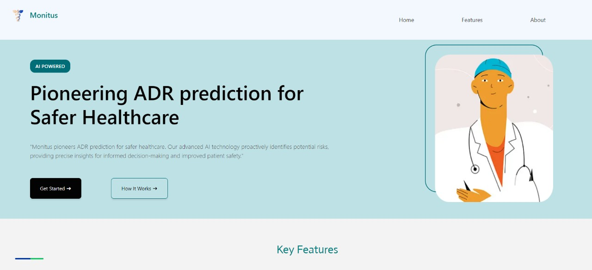

# MONITUS AI - Adverse Drug Reaction Prediction Tool



MONITUS AI is an AI-powered tool designed to predict Adverse Drug Reactions (ADRs). This tool not only predicts ADRs but also provides a mechanism to store and collect data related to these reactions, aiding in data collection and database management.

## Table of Contents

- [Features](#features)
- [Installation](#installation)
- [Usage](#usage)
- [Contributing](#contributing)
- [License](#license)

## Features

- Predicts Adverse Drug Reactions using AI algorithms.
- Stores and collects data related to ADRs.
- Efficient database management.

## Installation

Follow these steps to install MONITUS AI on your local machine:

1. Clone the MONITUS AI repository to your local machine:

   ```bash
   git clone https://github.com/Sreehari78/MonitusAI.git
   ```

2. Navigate to the project directory:

   ```bash
   cd MONITUS-AI
   ```

3. Install the required dependencies. It is recommended to set up a virtual environment before installing dependencies:

   ```bash
   python -m venv venv
   source venv/bin/activate  # On Windows, use 'venv\Scripts\activate'
   pip install -r requirements.txt
   ```

4. Set up the database:

   ```bash
   python manage.py migrate
   ```

5. Run the development server:

   ```bash
   python monitus_server.py
   ```

6. Run client server:

   ```bash
   npm i
   npm run dev
   ```

7. Open your web browser and navigate to [http://127.0.0.1:3000/](http://127.0.0.1:3000/) to access MONITUS AI.

## Usage

### Predict Page

The Predict page serves multiple functions:

- **Predict Drug-drug interaction**

  - From ONCHigh and DrugBank dataset

- **Predict ADRs (Adverse Drug Reactions):**

  - Based on FAERS dataset for ADR reports and based on patients medical history

- **Predict the Severity of ADRs:**
  - Estimate the severity levels of Adverse Drug Reactions.

### Report ADRs Page

The Report ADRs page is designed to:

- **Report symptoms or Observed ADRs:**
  - Can be used to report symtoms obsereved by a patient
- **The user can select from the predicted ADRs**
  - The predicted ADRs can be selected or new ones can be added

### Upload Electronic Health Record

The Upload Electronic Health Record feature allows you to:

- **insert Patient into the database:**
  - Helps in analysing previous medical conditions to give predictions
- **View uploaded ehr**
  - Can view ehr before uploading to database

### ADR Report Page

The ADR Report page provides:

- **Visual Representation of Observed Symptoms:**
  - Offers a visual representation of all observed symptoms in patients who have been prescribed a particular medicine.

## Contributing

We welcome contributions from the community. If you want to contribute to MONITUS AI, please follow these steps:

1. Fork the repository.
2. Create a new branch (`git checkout -b feature/your-feature-name`).
3. Make your changes and commit them (`git commit -m 'Add some feature'`).
4. Push to the branch (`git push origin feature/your-feature-name`).
5. Open a pull request.

Please make sure to follow our [Code of Conduct](CODE_OF_CONDUCT.md) and [Contributing Guidelines](CONTRIBUTING.md).

## License

This project is licensed under the [MIT License](LICENSE).

## Acknowledgments

We would like to acknowledge the developers and contributors who have helped shape MONITUS AI. Special thanks to [List of contributors, libraries, or resources you want to acknowledge].

## Contact

For any inquiries or assistance, please contact us at:

- [Pranav S](mailto:pranavs13@gmail.com)
- [Sreehari s](mailto:sreehari1672000@gmail.com)
- [Akhil Vettical](mailto:akhilbinoyvettical@gmail.com)
- [Richard Joseph](mailto:richardj815165@gmail.com)

Feel free to reach out to any of the team members with your questions or feedback.
